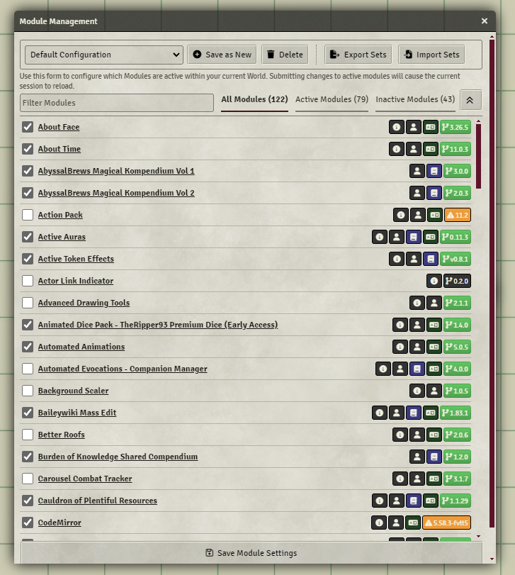
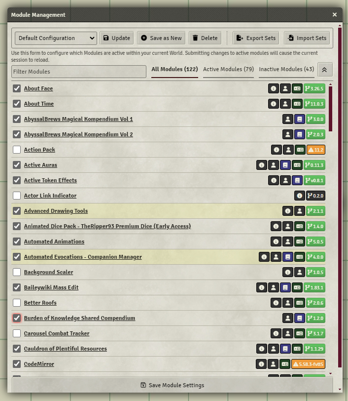

# Coffee Pub Monarch

A FoundryVTT module that allows you to save and load different sets of module configurations. Perfect for switching between different game systems or play styles that require different sets of modules.

### Module Management Interface


### Visual Feedback for Module Changes


## Features

- Save your current module configuration as a named set
- Load previously saved module sets with a single click
- Visual feedback showing which modules will be enabled/disabled when loading a set
- Automatically tracks the currently active module set
- Maintains a "Default Configuration" based on your initial module setup
- Export and import module sets for sharing or backup

## Installation

You can install this module by using the following manifest URL in Foundry VTT:
```
https://raw.githubusercontent.com/Drowbe/coffee-pub-monarch/master/module.json
```

## Usage

1. Open the Module Management window in Foundry VTT
2. You'll see new controls above the module list:
   - A dropdown to select saved module sets
   - "Load Set" button to apply the selected set
   - "Save as New" button to save your current configuration
   - "Update" button to update an existing set
   - "Delete" button to remove saved sets
   - "Export Sets" and "Import Sets" buttons for sharing configurations

When you select a module set from the dropdown:
- Modules that will be enabled are highlighted in green
- Modules that will be disabled are highlighted in red
- Changes to the current configuration are highlighted in yellow (as shown in the second screenshot)

## License

This module is licensed under the MIT License. See the LICENSE file for details. 