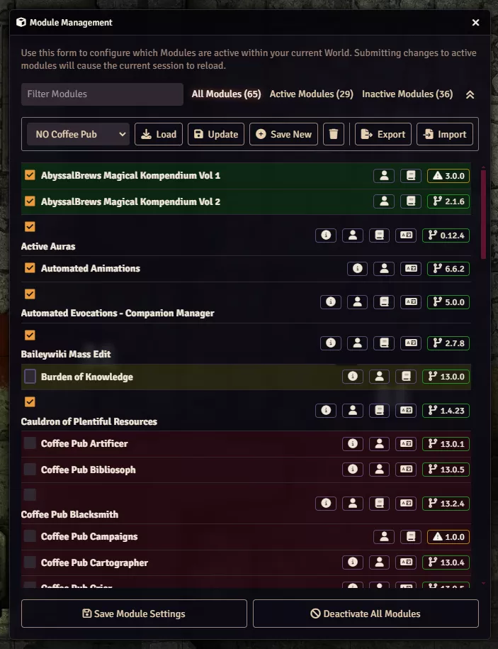
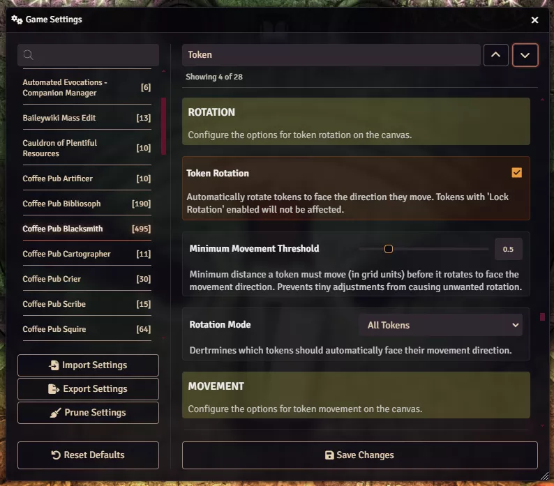
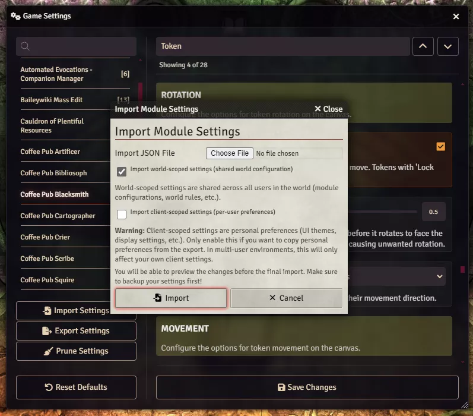
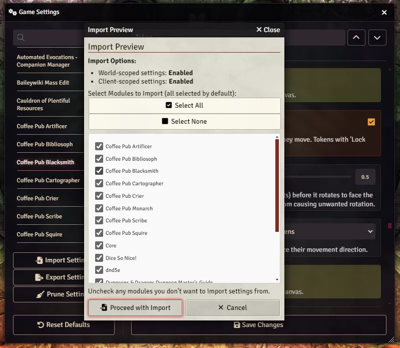
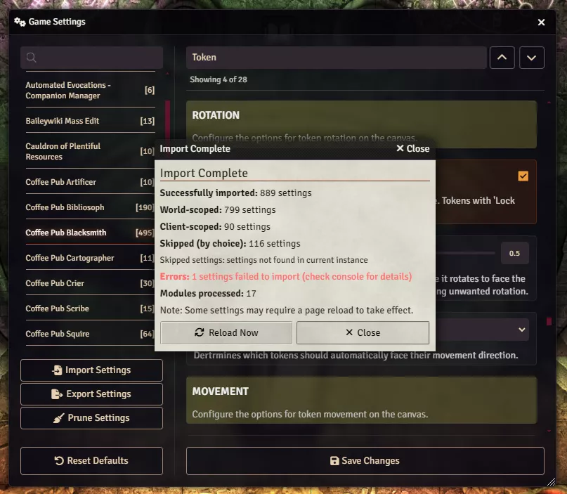
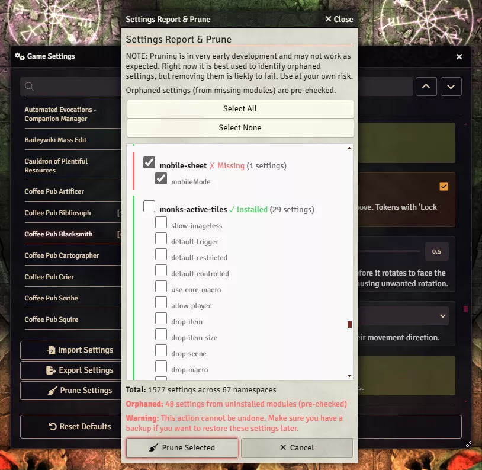

# Coffee Pub Monarch


A Foundry VTT module for saving and loading different module configurations and managing game settings. Switch between game systems or play styles with one click, export or import full settings backups with fine-grained control, and quickly jump to any setting by name—all without leaving the Module Management or Configure Settings windows.

> **Note:** Version 12.1.3 is the final release for Foundry v12. All subsequent releases target v13+.

## Features

- **Module sets**
  - Save your current module configuration as a named set and load it with one click
  - Visual feedback: green/red for modules that will be enabled/disabled when loading a set; yellow when editing a set
  - Tracks the active set and keeps a "Default Configuration" from your initial setup
  - Export and import module sets for backup or sharing

- **Settings window**
  - **Export / Import:** Backup or restore all game and module settings. Choose world- and/or client-scoped settings and select which modules to include
  - **Jump to setting:** Search at the top of the categories list scrolls to a matching setting; prev/next cycle through matches. Nothing is hidden—only scroll position changes
  - **Prune:** Remove orphaned settings (from uninstalled modules) or selected settings from storage

## Screenshots

### Module Management — Sets and change highlighting


### Settings window — Jump to setting
Type to jump to a setting by name; use prev/next to cycle through matches.


### Settings window — Import (select file and scope)


### Settings window — Import preview


### Settings window — Import result


### Settings window — Prune settings


## Installation

You can install this module using the following manifest URL in Foundry VTT:

```
https://github.com/Drowbe/coffee-pub-monarch/releases/latest/download/module.json
```

## Usage

### Module Management
1. Open the **Module Management** window in Foundry VTT.
2. Use the controls above the module list:
   - Dropdown to select a saved module set, then **Load Set** to apply it
   - **Save as New** to save the current configuration; **Update** to overwrite the current set; **Delete** to remove a set
   - **Export Sets** and **Import Sets** for backup or sharing
3. **Visual feedback:** When selecting a set, modules that will change are highlighted (green = enabled, red = disabled). When editing a set, changes are highlighted in yellow.

### Settings window
- **Configure Settings:** Import/Export/Prune buttons appear in the sidebar. **Export Settings** saves all settings to a JSON file; **Import Settings** restores with scope and per-module options; **Prune Settings** removes orphaned or selected settings.
- **Jump to setting:** At the top of the categories list, type in the search to scroll to a matching setting; use the up/down buttons to move between matches. The list is not filtered—everything stays visible.

## License

This module is licensed under the [MIT License](LICENSE).

## Contributing

Feel free to submit issues and enhancement requests!
