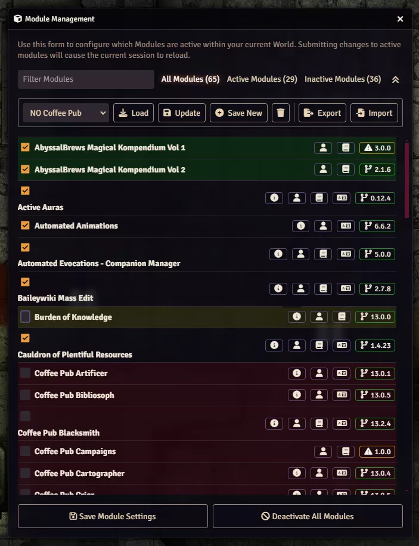
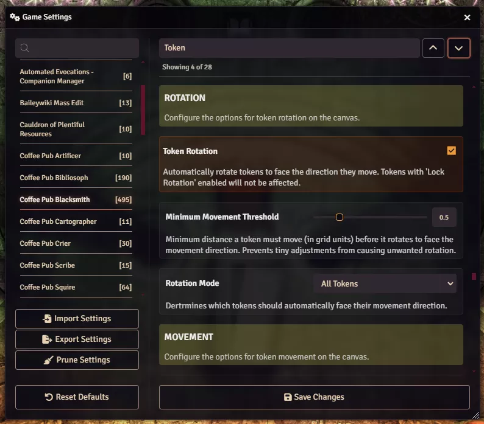

# Getting Started with Monarch

**Audience:** GMs installing Coffee Pub Monarch for the first time.

What Monarch needs, how to install it, and what changes on screen the moment it is enabled.

## What Monarch does

Monarch adds three things to Foundry's own windows. It does not add a window of its own, and it has no
toolbar button.

In **Manage Modules**, it lets you save your current set of enabled modules under a name and switch
between saved sets with one click. Useful when you run more than one game, or when you want a stripped
back set for testing.

In **Configure Settings**, it adds buttons to export every setting in your world to a file, import
them back, and clear out settings left behind by modules you have uninstalled. It also adds a second
search box that jumps to a setting by name without hiding anything else.

## Before you install

- **Foundry VTT version 13 or 14.**
- **No other modules are required.** Monarch has no dependencies, including on other Coffee Pub
  modules.
- **You need to be a GM** for the module set features. See
  [what players see](userguide-player.md).

## Installing

1. In Foundry, go to **Add-on Modules** and **Install Module**.
2. Paste this manifest URL:
   `https://github.com/Drowbe/coffee-pub-monarch/releases/latest/download/module.json`
3. Open your world, go to **Manage Modules**, and enable Monarch.

## What changes on screen

**In Manage Modules**, a row of controls appears just below the search box: a dropdown listing your
saved module sets, and buttons to load, update, save, delete, export, and import them. The first time
you open it, Monarch saves your current configuration as a set called "Default Configuration" so you
always have something to return to.

**In Configure Settings**, three buttons appear near Reset Defaults: **Import Settings**, **Export
Settings**, and **Prune Settings**. A second search box appears at the top of the settings list,
labelled "Type to jump to setting...".

## The first five minutes

Do this once, now, so you have a backup before you change anything:

1. Open **Configure Settings** and click **Export Settings**. Save the file somewhere outside your
   Foundry data folder. This is your settings backup.
2. Open **Manage Modules**. Your current setup is already saved as "Default Configuration".
3. Click **Export** in the module set controls to save your sets to a file as well.

You now have a way back from anything.

## Where to go next

- [Module sets](userguide-module-sets.md) covers saving, loading, and switching configurations.
- [Backing up and restoring settings](userguide-settings-backup.md) covers export and import in
  detail, including what world and personal settings mean.
- [Jump to setting](userguide-jump-to-setting.md) covers the search box.
- [Pruning orphaned settings](userguide-prune-settings.md) covers clearing out settings left behind by
  uninstalled modules. Read it before you use that button.
- [Monarch's own settings](userguide-settings.md) is short, because it has none you can configure.
</content>
</invoke>
