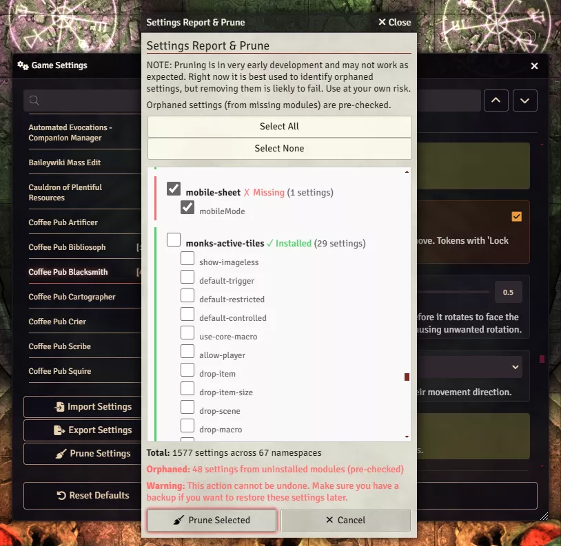

# Pruning Orphaned Settings

**Audience:** GMs cleaning up settings left behind by modules they have uninstalled.

Finding settings whose module is gone, and deleting them safely.

Foundry never removes a module's settings when you uninstall it. The values stay in the world
database, invisible, forever. A world that has been running for years and tried a lot of modules can
be carrying thousands of them.

Pruning deletes those leftovers. **It cannot be undone.**
[Export your settings](userguide-settings-backup.md) first.

## Running a report

Open **Configure Settings** and click **Prune Settings**. Monarch scans the world and shows every
setting it can find, grouped by the module that owns it, with a total at the top.

Each group is marked either **Installed** or **Missing**. Missing means the module is not installed in
this Foundry instance, so nothing will ever read those settings again. Those groups are ticked for you.

You can run this report and close it without deleting anything. That is a reasonable thing to do on
its own, just to see what has accumulated.

## Deleting

Review what is ticked, then click **Prune Selected**. Use **Select All** and **Select None** if you
want to start from a different position.

Untick anything you are unsure about. A module you have temporarily uninstalled and mean to reinstall
will show as Missing, and pruning it throws away its configuration.

Reload Foundry afterwards.

## Disabled is not uninstalled

A module that is installed but switched off still counts as installed, and its settings are not
orphaned. This is deliberate: you turn modules off all the time, and pruning their settings would lose
your configuration every time you did.

To genuinely remove a module's settings, uninstall the module first, then prune.

If you prune a setting while its module is still installed, the module simply registers it again with
its default value the next time Foundry loads. Monarch warns you when this is about to happen rather
than reporting a success that will not stick.

## What pruning does not touch

**Personal settings stored in your browser are never pruned.** Monarch removes world and user settings,
which live in the world database, and deliberately leaves client-scoped settings alone.

The reason is worth stating, because it looks like a gap. Browser storage is shared with everything
else Foundry and its modules keep there, including login credentials for hosting services and bins of
recoverable deleted documents. There is no reliable way to tell an abandoned setting apart from data
something still needs, and testing found that a plausible-looking filter would have offered a live API
key for deletion. Monarch will not guess with that store.

The practical effect is that pruning cleans the shared world configuration, which is where the bulk of
the accumulation is, and leaves your own browser preferences untouched.

## If the report looks wrong

The total counts every setting Monarch can see, including those belonging to installed modules, so it
will be much larger than the number of orphans. The orphan count is reported separately, in red, above
the buttons.

Namespaces beginning with an underscore, or with names you do not recognise, are usually real: Foundry
core and some libraries register settings under names that do not match any module title you have
seen.
</content>
</invoke>
