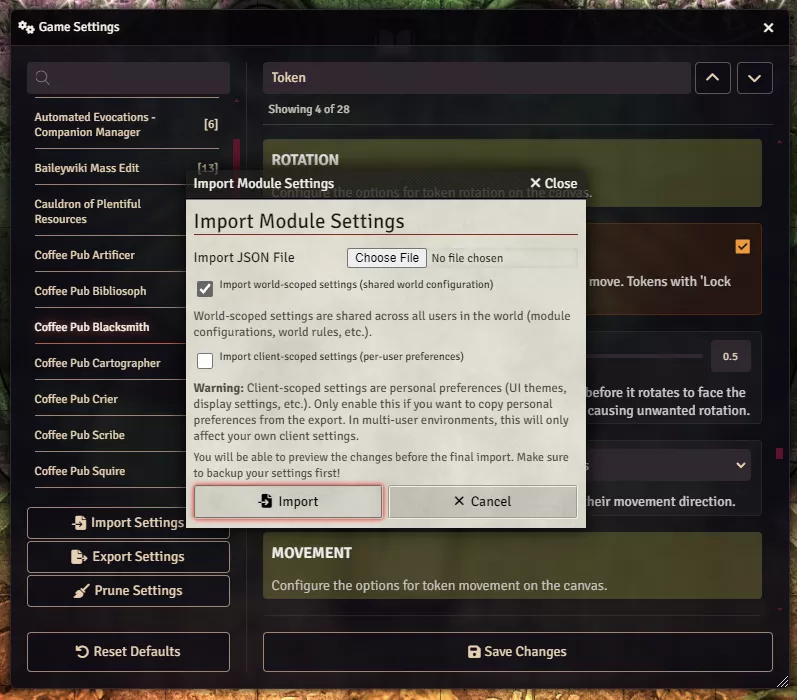
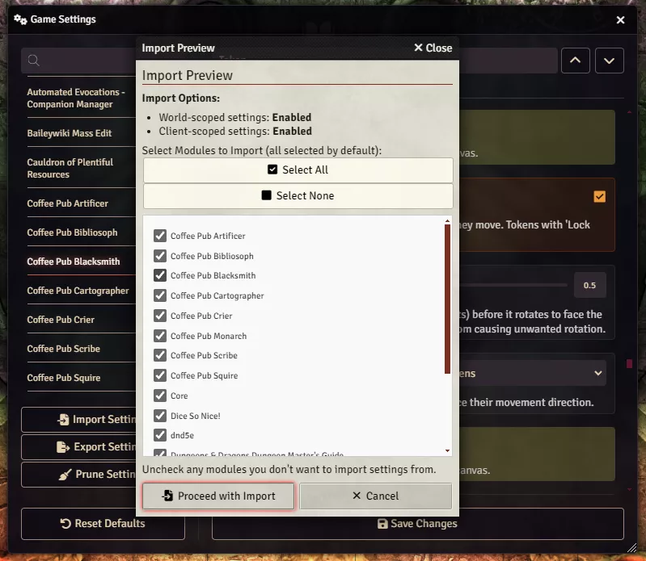
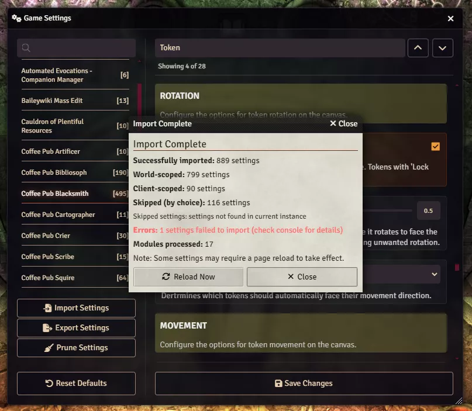

# Backing Up and Restoring Settings

**Audience:** GMs backing up a world's settings, moving them to another world, or restoring after
something went wrong.

Exporting every setting to a file, and importing it back with control over what gets overwritten.

This covers the settings modules store, not which modules are enabled. For that, see
[module sets](userguide-module-sets.md).

## Exporting

Open **Configure Settings** and click **Export Settings**. A JSON file downloads, named with the
current date and time.

The export contains every registered setting in the world, from Foundry core, the game system, and
every enabled module, along with each setting's scope and default. Settings from modules that are
installed but disabled are not included, because a disabled module never registers its settings.

Do this before any large change. It is the only way back from a bad import or an over-enthusiastic
prune.

## The two kinds of setting

Import asks you to choose which kinds to restore, and the distinction matters.

**World settings** are shared by everyone in the world: module configuration, house rules, anything
that changes how the game behaves for the whole table. Changing these affects every player. **Only a
GM can import them.**

**Personal settings** are yours alone: interface themes, display preferences, window positions. On
Foundry v14 this covers both client-scoped settings, stored in your browser, and user-scoped settings,
stored in the world against your user account. Importing them changes only your own experience, never
another player's.

If you are moving a world to a new machine, you usually want both. If you are copying one GM's
preferred interface to another person, you want personal only.

## Importing

1. Click **Import Settings**.
2. Choose your JSON file.
3. Tick which kinds to import. World settings are ticked by default for a GM and disabled entirely for
   a player.
4. Click Import.

Monarch then shows a preview before anything is written.

The preview lists every module in the file and how many of its settings will be applied, and lets you
untick any module you want to leave alone. Nothing has been changed at this point. Read it, untick
what you do not want, and confirm.

The result screen reports what was applied, what was skipped and why, and what failed. Reload Foundry
afterwards so every module picks up its new values.

## What import will not do

- **It will not create settings for modules you do not have.** A setting whose module is not installed
  and enabled has nowhere to go, and is counted as skipped.
- **It will not import world settings for a player.** The checkbox is disabled and the settings are
  counted as permission denied.
- **It will not fix a setting whose format has changed.** If a module changed how it stores a value
  between versions, the old value may be rejected by that module's own validation. These appear in the
  result as failures with the reason given.

## If you pick the wrong file

Module set exports and settings exports are both JSON and look similar. Monarch checks which one you
gave it and tells you which button you wanted rather than importing nonsense.
</content>
</invoke>
